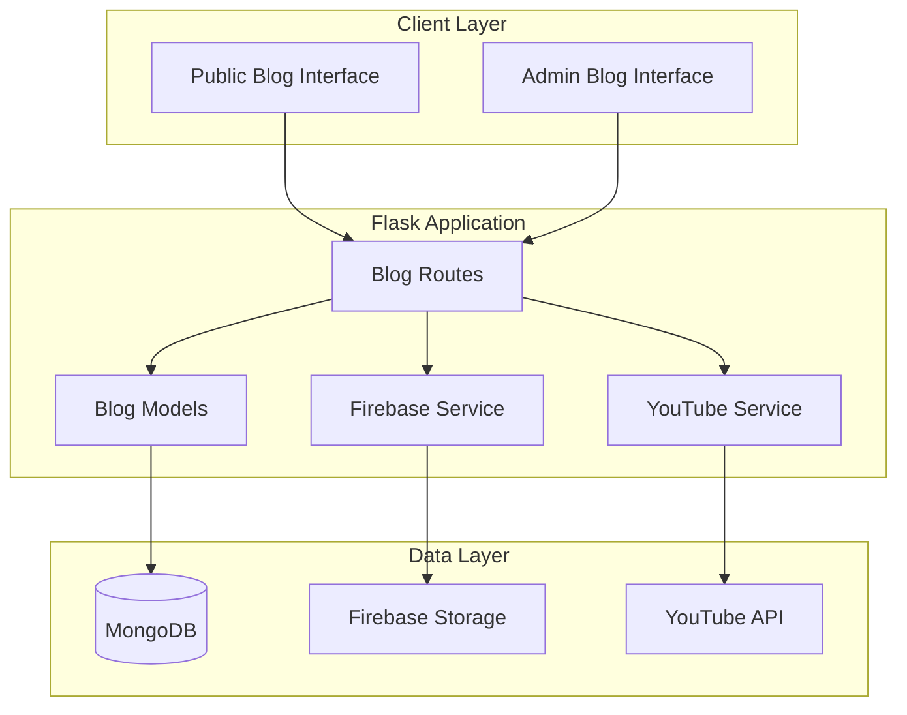

# Blog System Design Document

## Overview

The Blog System is a comprehensive content management feature that extends the Muscle Hustle fitness application with public-facing blog functionality. The system enables administrators to create, manage, and publish blog posts about fitness and lifestyle topics while providing visitors with an engaging reading experience without requiring authentication.

The architecture integrates with the existing Flask/MongoDB infrastructure while adding Firebase Storage for image management and YouTube embedding for video content. The system maintains separation between public content consumption and administrative content management, ensuring optimal performance for both use cases.

## Architecture

### High-Level Architecture



### Component Integration

The blog system integrates with existing Muscle Hustle components:
- **Authentication**: Leverages existing Flask-Login admin authentication
- **Database**: Extends MongoDB with new blog posts collection
- **Templates**: Uses existing base template and design system
- **Routes**: Adds new blueprint following established patterns

## Components and Interfaces

### Blog Post Model

The `BlogPost` class provides the core data model with methods for CRUD operations:

```python
class BlogPost:
    def __init__(self, data):
        self._id = data.get('_id')
        self.title = data.get('title')
        self.content = data.get('content')
        self.content_type = data.get('content_type', 'html')  # 'html' or 'plain'
        self.status = data.get('status', 'draft')  # 'draft' or 'published'
        self.author_id = data.get('author_id')
        self.author_name = data.get('author_name')
        self.images = data.get('images', [])  # Array of image objects
        self.youtube_videos = data.get('youtube_videos', [])  # Array of video objects
        self.created_at = data.get('created_at')
        self.updated_at = data.get('updated_at')
        self.published_at = data.get('published_at')
```

### Firebase Storage Service

The `FirebaseService` handles image upload and URL management:

```python
class FirebaseService:
    def upload_image(self, file, path_prefix="blog-images"):
        # Upload image to Firebase Storage
        # Return download URL and metadata
        
    def delete_image(self, file_path):
        # Remove image from Firebase Storage
        
    def get_download_url(self, file_path):
        # Generate fresh download URL for existing file
```

### YouTube Embedding Service

The `YouTubeService` validates and processes YouTube video links:

```python
class YouTubeService:
    def validate_youtube_url(self, url):
        # Validate YouTube URL format
        # Extract video ID
        
    def generate_embed_code(self, video_id, options=None):
        # Generate responsive iframe embed code
        
    def extract_video_metadata(self, video_id):
        # Get video title and thumbnail (optional)
```

### Blog Routes Blueprint

The blog routes handle both public and administrative interfaces:

- **Public Routes**:
  - `GET /blog` - List published blog posts
  - `GET /blog/<post_id>` - View individual blog post
  
- **Admin Routes** (require admin authentication):
  - `GET /admin/blog` - Blog management dashboard
  - `GET /admin/blog/new` - Create new blog post form
  - `POST /admin/blog/new` - Handle blog post creation
  - `GET /admin/blog/<post_id>/edit` - Edit blog post form
  - `POST /admin/blog/<post_id>/edit` - Handle blog post updates
  - `POST /admin/blog/<post_id>/delete` - Delete blog post
  - `POST /admin/blog/<post_id>/publish` - Toggle publish status

## Data Models

### MongoDB Collections

#### Blog Posts Collection

```javascript
{
  _id: ObjectId,
  title: String,
  content: String,  // HTML or plain text content
  content_type: String,  // "html" or "plain"
  status: String,  // "draft" or "published"
  author_id: ObjectId,  // Reference to users collection
  author_name: String,  // Denormalized for performance
  images: [
    {
      firebase_path: String,  // Path in Firebase Storage
      download_url: String,   // Firebase download URL
      caption: String,        // Optional image caption
      alt_text: String,       // Accessibility text
      order: Number          // Display order
    }
  ],
  youtube_videos: [
    {
      video_id: String,      // YouTube video ID
      url: String,           // Original YouTube URL
      title: String,         // Video title (optional)
      embed_code: String,    // Generated iframe code
      order: Number          // Display order
    }
  ],
  created_at: Date,
  updated_at: Date,
  published_at: Date,  // Set when status changes to published
  view_count: Number,  // Optional: track post views
  tags: [String]       // Optional: categorization tags
}
```

#### Database Indexes

```javascript
// Compound index for published posts ordered by date
db.blog_posts.createIndex({ "status": 1, "published_at": -1 })

// Index for admin management queries
db.blog_posts.createIndex({ "author_id": 1, "created_at": -1 })

// Text search index for future search functionality
db.blog_posts.createIndex({ "title": "text", "content": "text" })
```

### Firebase Storage Structure

```
blog-images/
├── {post_id}/
│   ├── image_1_{timestamp}.jpg
│   ├── image_2_{timestamp}.png
│   └── thumbnail_{timestamp}.jpg
└── temp/
    └── {upload_id}_{timestamp}.{ext}  // Temporary uploads
```

## Correctness Properties

*A property is a characteristic or behavior that should hold true across all valid executions of a system-essentially, a formal statement about what the system should do. Properties serve as the bridge between human-readable specifications and machine-verifiable correctness guarantees.*
B
ased on the prework analysis, I'll now define the correctness properties that ensure the blog system behaves correctly across all valid inputs and scenarios.

### Property Reflection

After reviewing all properties identified in the prework, I've identified several areas where properties can be consolidated:

- Properties 2.5, 6.1, and 6.3 all relate to database storage and retrieval - these can be combined into comprehensive data persistence properties
- Properties 4.2, 4.3, and 4.4 all relate to status visibility - these can be combined into a single status visibility property
- Properties 2.3 and 6.2 both relate to image upload workflow - these can be combined into a single image upload round-trip property

### Correctness Properties

**Property 1: Published posts visibility**
*For any* collection of blog posts with mixed statuses, the public blog interface should only display posts with "published" status, ordered by publication date in reverse chronological order
**Validates: Requirements 1.1, 1.3**

**Property 2: Blog post navigation**
*For any* blog post displayed in the public interface, clicking the title should generate a valid URL that opens the full post content
**Validates: Requirements 1.2**

**Property 3: Media content rendering**
*For any* blog post containing images or YouTube videos, the rendered HTML should include properly formatted img tags with Firebase URLs and responsive iframe embeds for YouTube content
**Validates: Requirements 1.4, 1.5**

**Property 4: Content format support**
*For any* blog post content, the system should accept and correctly store both HTML and plain text formats, preserving the content_type metadata
**Validates: Requirements 2.2**

**Property 5: Image upload round-trip**
*For any* valid image file uploaded by an admin, the system should successfully upload to Firebase Storage, store the download URL in MongoDB, and make the image accessible via the stored URL
**Validates: Requirements 2.3, 6.2**

**Property 6: YouTube URL processing**
*For any* valid YouTube URL provided by an admin, the system should extract the video ID, validate the URL format, and generate proper responsive iframe embed code
**Validates: Requirements 2.4, 6.5**

**Property 7: Blog post persistence**
*For any* blog post created by an admin, the system should store all required fields (title, content, author info, timestamps) in MongoDB and make the data retrievable
**Validates: Requirements 2.5, 6.1, 6.3**

**Property 8: Publication workflow**
*For any* blog post, changing the status from draft to published should make it visible on the public interface, and changing from published to draft should remove it from public visibility
**Validates: Requirements 2.6, 4.2, 4.3, 4.4**

**Property 9: Edit preservation**
*For any* blog post being edited, the system should preserve the original creation date while updating the modification timestamp and immediately reflect changes in all interfaces
**Validates: Requirements 3.2, 3.4**

**Property 10: Complete deletion**
*For any* blog post being deleted, the system should remove it from both the admin management interface and public display, ensuring no references remain
**Validates: Requirements 3.3**

**Property 11: Status indication**
*For any* blog post displayed in the admin interface, the system should clearly show the current publication status (draft/published) along with relevant timestamps
**Validates: Requirements 4.5**

**Property 12: External link handling**
*For any* external links within blog post content, the rendered HTML should include target="_blank" attributes to open links in new tabs
**Validates: Requirements 5.5**

## Error Handling

### Firebase Storage Error Handling

The system implements graceful degradation when Firebase Storage is unavailable:

- **Upload Failures**: Display user-friendly error messages and allow retry
- **Image Loading Failures**: Show placeholder images with error indicators
- **Connection Timeouts**: Implement retry logic with exponential backoff
- **Authentication Errors**: Log errors and notify administrators

### YouTube Embedding Error Handling

- **Invalid URLs**: Validate YouTube URL format before processing
- **Private/Deleted Videos**: Handle embed failures gracefully
- **API Rate Limits**: Implement caching for video metadata
- **Network Failures**: Show fallback content when embeds fail to load

### Database Error Handling

- **Connection Failures**: Implement connection pooling and retry logic
- **Validation Errors**: Provide clear feedback for invalid data
- **Duplicate Content**: Handle unique constraint violations
- **Transaction Failures**: Ensure data consistency with proper rollback

### Input Validation

- **File Upload Security**: Validate file types, sizes, and content
- **XSS Prevention**: Sanitize HTML content while preserving formatting
- **CSRF Protection**: Implement tokens for all admin forms
- **SQL Injection Prevention**: Use parameterized queries (MongoDB best practices)

## Testing Strategy

The blog system requires comprehensive testing using both unit tests and property-based tests to ensure correctness across all scenarios.

### Unit Testing Approach

Unit tests will cover specific examples and integration points:

- **Route Testing**: Verify HTTP responses for all endpoints
- **Template Rendering**: Ensure correct HTML output for various content types
- **Authentication**: Test admin access controls and public access
- **Form Validation**: Verify input validation and error handling
- **Database Operations**: Test CRUD operations with specific data

### Property-Based Testing Approach

Property-based tests will verify universal properties using **Hypothesis** (Python property-based testing library). Each test will run a minimum of 100 iterations with randomly generated data.

**Property-Based Test Requirements**:
- Each correctness property must be implemented by a single property-based test
- Tests must be tagged with comments referencing the design document property
- Tag format: `**Feature: blog-system, Property {number}: {property_text}**`
- Generate diverse test data including edge cases (empty content, large files, special characters)
- Test with various user roles and authentication states

**Test Data Generation**:
- **Blog Posts**: Random titles, content (HTML/plain text), statuses, dates
- **Images**: Various file formats, sizes, and metadata
- **YouTube URLs**: Valid/invalid formats, different video types
- **User Inputs**: Including malicious content for security testing

### Integration Testing

- **Firebase Integration**: Test actual file uploads and retrievals
- **YouTube Embedding**: Verify iframe generation and responsiveness
- **Database Consistency**: Test concurrent operations and data integrity
- **End-to-End Workflows**: Complete blog creation and publication flows

### Performance Testing

- **Page Load Times**: Measure blog list and individual post loading
- **Image Loading**: Test Firebase Storage performance
- **Database Queries**: Optimize query performance with proper indexing
- **Concurrent Users**: Test system behavior under load

## Implementation Notes

### Security Considerations

- **File Upload Security**: Implement comprehensive validation (file type, size, content scanning)
- **Content Security Policy**: Configure CSP headers for iframe embedding
- **Input Sanitization**: Use bleach library for HTML content sanitization
- **Authentication**: Leverage existing Flask-Login admin authentication
- **HTTPS**: Ensure all Firebase and YouTube embeds use HTTPS

### Performance Optimizations

- **Database Indexing**: Implement compound indexes for common queries
- **Image Optimization**: Consider image resizing and compression
- **Caching**: Implement caching for frequently accessed blog posts
- **CDN Integration**: Leverage Firebase Storage's CDN capabilities
- **Lazy Loading**: Implement lazy loading for images and videos

### Scalability Considerations

- **Pagination**: Implement pagination for blog post lists
- **Search Functionality**: Prepare for future search feature with text indexes
- **Content Versioning**: Consider version history for blog posts
- **Multi-Author Support**: Design supports multiple admin authors
- **Content Categories**: Schema supports future categorization features